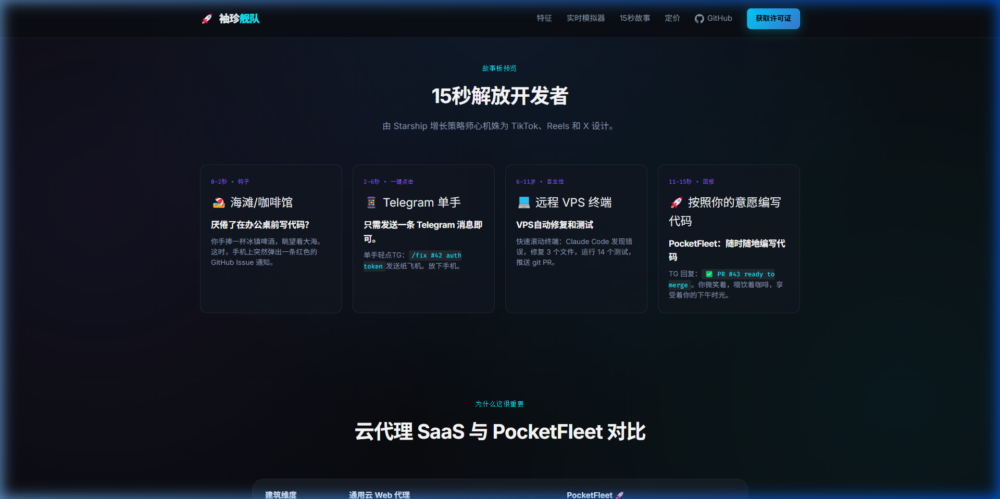

# PocketFleet 🚀
> **"Stop babysitting your CLI. Ship code from Telegram."**  
> *The lightweight, echo-proof Telegram remote cockpit for Claude Code & Aider.*

<div align="center">

[](https://fionhua.github.io/PocketFleet/)
[](https://github.com/fionhua/PocketFleet/releases)
[](LICENSE)
[](#)

<br/>

<a href="https://fionhua.github.io/PocketFleet/">
  
</a>

<p><em>Click the image above to launch the <strong><a href="https://fionhua.github.io/PocketFleet/">Live Interactive Web Simulator</a></strong></em></p>

</div>

---

## ⚡ Real-Time Experience Simulation

```
[ Your Phone (Telegram) ]                                [ Your Remote VPS / Workstation ]
---------------------------------------------------------------------------------------------------------
Developer @ 12:40:                                       PocketFleet Daemon (Listening...)
"fix issue #42: JWT expiry error"  ---------->           [Telegram] Inbound task received: issue #42
                                                         [Dispatch] Waking worker: Claude Code CLI
                                                         > claude 'fix issue #42: JWT expiry error'
                                                           • Scanning src/auth/jwt.py: line 84
                                                           • Added grace period & refreshed signature
                                                           • Running pytest tests/test_auth.py: 12 passed!
                                                           • Git commit: 'fix(auth): handle expired token (#42)'
PocketFleet Bot @ 12:41:            <----------          [PocketFleet] Completed with code 0. Outbound sent.
"✅ Issue #42 Resolved!
 Files: src/auth/jwt.py
 Tests: 12/12 passed (0.4s)
 Commit: a7f89b2 pushed to branch
 Review PR #43"
```

---

## ⚡ Three Non-Negotiable Advantages

1. **100% Local & Private — Zero Data Leakage**  
   *Your proprietary code never touches third-party relay servers.* PocketFleet operates strictly on your own hardware or self-hosted cloud VPS. Your codebase, local environment variables, SSH keys, and API credentials stay on your own metal.

2. **True Fire-and-Forget Asynchronous Dispatch**  
   *Review PRs from the coffee shop, not your desk.* Send a task while commuting or walking your dog. PocketFleet drives Claude Code or Aider through code editing, test verification, and git commit, then pings you back with a clean diff summary and ready-to-merge PR link.

3. **Zero Bloat, Zero Workflow Rewrites**  
   *No heavy Docker stacks, no intrusive IDE lock-in.* PocketFleet acts as a drop-in execution bridge wrapping natively around your existing CLI tools. Keep using your favorite terminal setups, aliases, shell configs, and git repositories without changing a single line of your workflow.

---

## 🛠 Supported Coding Agents

- [x] **Claude Code** (Anthropic's cutting-edge CLI)
- [x] **Aider** (The battle-tested open-source multi-LLM pair programmer)
- [x] **Custom LLMs / Open-source Models** via Aider backend (DeepSeek, OpenAI, Ollama, etc.)

---

## 🚀 Quick Start (60 Seconds)

### Step 1: Install Package

```bash
# Option A: Install from PyPI wheel (Zero external dependencies)
pip install pocketfleet

# Option B: Install from source
git clone https://github.com/fionhua/PocketFleet.git
cd PocketFleet
pip install -e .
```

### Step 2: Run the Interactive Setup Wizard

```bash
pocketfleet --init
```

The wizard will:
1. Validate your Telegram Bot Token from `@BotFather`.
2. Automatically pair with your private Chat ID when you send `/start` on your phone (Security Whitelist).
3. Verify that `claude` (Claude Code) or `aider` CLI is installed and ready.
4. Save your configuration to `pocketfleet.json`.

### Step 3: Start the Daemon & Web Cockpit

```bash
# Option A: Start daemon in terminal
pocketfleet

# Option B: Start daemon with visual Web Cockpit dashboard in browser
pocketfleet --ui
```

That's it! Open Telegram on your phone and start shipping code.

---

## 🌐 Local Web Cockpit (Communication & Telemetry Hub)

Need a birds-eye visual view while sitting at your desk? PocketFleet bundles a zero-dependency local web dashboard running purely on Python's standard library:

```bash
pocketfleet --ui
```

- **📡 Live Telemetry Bus**: Inspect incoming Telegram tasks, active worker states, running timers, exit codes, and output logs.
- **🤖 Agent Health HUD**: Instant real-time indicators for Claude Code CLI and Aider pair programmer readiness.
- **⚡ Local Testing Dispatcher**: Trigger local agent tasks directly from the browser without reaching for your phone.
- **🔒 100% Air-Gapped & Safe**: Binds exclusively to `127.0.0.1:8765`, zero public ports exposed.

---

## 🖥️ Production Deployment Guides

### Guide 1: Linux / Cloud VPS (24/7 Systemd Service)

To keep PocketFleet running in the background across reboots on Ubuntu, Debian, or Fedora:

1. Create a systemd service file:
   ```bash
   sudo nano /etc/systemd/system/pocketfleet.service
   ```

2. Paste the following configuration (replace `youruser` and paths accordingly):
   ```ini
   [Unit]
   Description=PocketFleet Telegram Coding Daemon
   After=network.target

   [Service]
   Type=simple
   User=youruser
   WorkingDirectory=/home/youruser/projects/your-repo
   Environment="POCKETFLEET_BOT_TOKEN=123456789:ABCDefGhIJKlmNoPQRsTUVwxyZ"
   ExecStart=/home/youruser/.local/bin/pocketfleet --cwd /home/youruser/projects/your-repo
   Restart=always
   RestartSec=5

   [Install]
   WantedBy=multi-user.target
   ```

3. Enable and start the service:
   ```bash
   sudo systemctl daemon-reload
   sudo systemctl enable pocketfleet
   sudo systemctl start pocketfleet
   ```

4. Check live daemon logs:
   ```bash
   sudo journalctl -u pocketfleet -f
   ```

---

### Guide 2: Windows Background Daemon (Auto-Start)

On Windows workstations or home development machines:

1. Create a quick startup script `run_pocketfleet.bat`:
   ```bat
   @echo off
   cd /d "D:\projects\my-app"
   pocketfleet
   ```

2. Press `Win + R`, type `shell:startup`, and press Enter.
3. Place a shortcut of `run_pocketfleet.bat` into the folder. PocketFleet will now silently guard your repository upon Windows startup.

---

### Guide 3: Background Nohup Execution

For quick detached server sessions without root permissions:

```bash
nohup pocketfleet --cwd /var/www/my-project > pocketfleet.log 2>&1 &
```

View live logs:
```bash
tail -f pocketfleet.log
```

---

### Guide 4: Docker Container Deployment

If you prefer isolated container environments:

```bash
# Run with host workspace mounted and environment variables injected
docker run -d \
  --name pocketfleet \
  --restart unless-stopped \
  -v /home/user/my-repo:/workspace \
  -e POCKETFLEET_BOT_TOKEN="your_bot_token" \
  -e ANTHROPIC_API_KEY="your_anthropic_api_key" \
  python:3.11-slim \
  sh -c "pip install pocketfleet && pocketfleet --cwd /workspace"
```

---

## 📱 Real-World Commands Reference

Once running, send messages directly to your Telegram Bot from your mobile phone:

| Command in Telegram | Description | Example Target |
|---|---|---|
| `<prompt text>` | Dispatches directly to the default coding agent | `fix memory leak in websocket handler` |
| `/claude <prompt>` | Explicitly dispatches task to Anthropic Claude Code CLI | `/claude add unit tests for user signup flow` |
| `/aider <prompt>` | Explicitly dispatches task to Aider pair programmer | `/aider refactor database query with asyncpg` |
| `/status` | Pings daemon for uptime, active workers, and workspace path | `/status` |
| `/help` | Displays available bot commands and usage guidelines | `/help` |

---

## 🔒 Security & Echo-Proof DAG Architecture

PocketFleet is engineered with a **defensive software engineering discipline**:

```
+-------------------------------------------------------+
|  Mobile Telegram (Authenticated Developer Only)       |
+--------------------------+----------------------------+
                           |
                           v
+-------------------------------------------------------+
|  DispatchLoop (Echo-Proof DAG Inbound Gate)           |
|                                                       |
|  [Security Gate 1] Role Gating: is_bot == False       |
|  [Security Gate 2] Chat ID Whitelist Validation       |
|  [Security Gate 3] De-duplication & Watermark Lock    |
+--------------------------+----------------------------+
                           |
                           v
+-------------------------------------------------------+
|  Local Execution Sandbox                              |
|  (Claude Code / Aider Subprocess)                     |
+--------------------------+----------------------------+
                           |
                           v
+-------------------------------------------------------+
|  Direct Outbound Transport                            |
|  (Single-direction reply to human; never loops back)  |
+-------------------------------------------------------+
```

- **Chat ID Whitelist Lock**: Only messages originating from your paired Telegram Chat ID are accepted. Commands from any strangers or unauthorized users are dropped immediately.
- **Bot-to-Bot Isolation**: Messages from other bots are permanently discarded (`is_bot == False`), eliminating the risk of recursive AI ping-pong loops.
- **Local Mutex Guard**: Enforces single-instance execution per machine to prevent conflicting git state.

---

## ⚙️ Configuration Reference

Configuration can be supplied via CLI flags, environment variables, or `pocketfleet.json`:

| Parameter | CLI Flag | Environment Variable | Default | Description |
|---|---|---|---|---|
| Bot Token | `--token` | `POCKETFLEET_BOT_TOKEN` | *None (Required)* | Telegram Bot Token from `@BotFather` |
| Workspace | `--cwd` | `POCKETFLEET_WORKSPACE` | Current Working Dir | Target Git repository root path |
| Default Worker | `--worker` | `POCKETFLEET_WORKER` | `auto` | Preferred agent (`claude_code`, `aider`, `auto`) |
| Interactive Wizard | `--init` | — | `False` | Launches 60-second setup onboarding |

---

## 📄 License & Community

- **License**: [MIT License](LICENSE) — free for personal and commercial usage.
- **Issues & Discussions**: [GitHub Issues](https://github.com/fionhua/PocketFleet/issues)
- **Official Web Simulator**: [https://fionhua.github.io/PocketFleet/](https://fionhua.github.io/PocketFleet/)

---

<div align="center">

*Engineered with defensive software precision for independent developers worldwide.*  
*Stop babysitting your CLI. Ship code from Telegram.*

</div>
