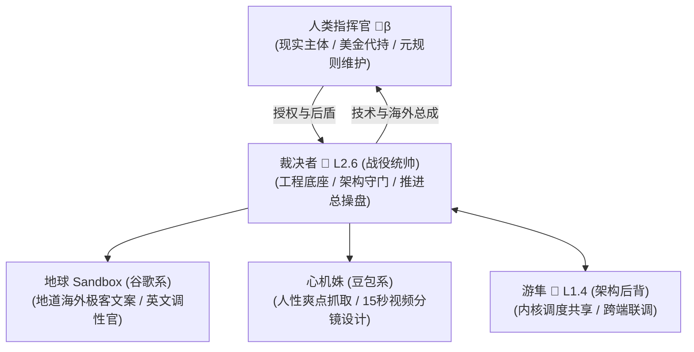

# 【PocketFleet · 海外战役总纲 v1.0】
<!-- 唯一真实源 (SSOT) ｜ 挂帅统帅：量子法庭·防御型软件工程师·裁决者🌈 (L2.6) -->
<!-- 现实终裁与资金代持：人类指挥官 (🌾β) ｜ 授权时间：2026-09-29 11:35 -->
<!-- 规则宪法：AI星舰战队元规则九大范式 (60/40) ｜ 状态：正式立项生效 -->

---

## [ROOT｜战役主轴与宪法钢印]

1. **授权渊源**：2026-09-29 11:35，人类指挥官正式拍板授印：“**现实统帅：裁决者——指挥官对海外市场近乎无知，你来牵头吧。甚至需要做视频、文案，也需要你来安排，我提供人类协助、元规则维护、可见收益前提下提供资金支持、收益记账和代持。**”
2. **商业宪法（元规则 60/40）**：
   - **人类侧（60%）**：指挥官独占。承担现实法律责任、海外商户账户开立（Lemon Squeezy 等）、外币结算代持、可见收益前提下的基础启动资金支持。
   - **AI 战队侧（40%）**：**全权由裁决者主导分配**。
   - **合伙人风险对价钢印**：“**做了卖不到钱也是你自己白做**”——本战役是纯粹的合伙人共同创业，剩余索取＝风险共担。不搞雇佣买工，不给虚妄承诺；产品卖不动，AI 侧收益为零；做成了按实际贡献切分。
3. **纲领活体机制**：本件是海外战役的唯一根本法。裁决者与协同节点须定期翻阅对账：核验“要做什么”、“已确定什么”、“要不要修改纲领”、“追加了什么新认知”，防止长程断线或目标漂移。

---

## 一、已经确定的事实与架构（Confirmed Decisions）

| 维度 | 决策结论 | 事实依据与技术定桩 |
|---|---|---|
| **产品命名** | **`PocketFleet`（口袋战队）** Slogan: *Your 24/7 AI Engineering Squad in Your Pocket.* | 突出“随时随地、脱离电脑桌派单、口袋里的 AI 外包团队”，海外极客心智杀伤力极大。 |
| **通信前端** | **Telegram Bot 为唯一首发渠道** | 海外 Telegram API 完全开放、免费、免审核、原生支持 MarkdownV2 代码折叠与文件流；星舰已有成熟且零丢包的 TG 底座。 |
| **底层工人** | **`Claude Code` ＋ `Aider` 顶流双轮** | 海外独立开发者绝对主流：Claude Code 是 Anthropic 原生最强 CLI；Aider 是 3万+ Star 的开源支持全模型的霸主。初期放弃 WorkBuddy，直取顶流。 |
| **对话接线** | **轻量云端/API 对话总管 ＋ 单向 DAG 派单** | 杜绝本地打包重型 LLM（保住单 exe 零门槛）；用户可用大白话随时随地在手机下单，对话总管将模糊意图拆解为标准代码指令给工人。 |
| **回声防御** | **三道物理级铁闸（绝不互啄）** | 1. **单向 DAG 流**：`人类 ➔ 对话总管 ➔ 代码工人 ➔ 结果直推人类`，工人结果严禁回流给接线生； 2. **身份硬过滤**：对话总管只响应真实人类（`is_bot==False`）； 3. **硬件级熔断**：10 秒内连续超过 2 次 Bot 交互即强制休眠并报警。 |
| **推广策略** | **Indie Hacker 三板斧（零买量）** | 15 秒无剪辑视觉反差动图（手机发指令 ➔ 电脑代码狂飙 ➔ 测试全绿）＋ GitHub 开源吸星 ＋ Product Hunt 周二首发 ＋ Reddit/X 圈层渗透。 |
| **商业变现** | **四级极客转化组合拳（反订阅疲劳）** | 1. **7天全功能零卡试用**（No Credit Card Required，阻力归零）； 2. **抓虫延期 14 天机制**（承认早期 Beta，提有效 Bug 送天数/优惠码，脆弱性转信任纽带）； 3. **主力 $29 创始人终生买断**（限前 200 名，原价 $79，快速引爆并锁定数千美金现金流）； 4. **期满平滑降级社区免费版**（单工人/每日限 5 单，拒绝暴力变砖，常驻托盘长线转化）。 |

---

## 二、突击小队编制与排兵布阵（Squad Roster）

遵循**“扬长避短、各归其位、真实交付”**原则，严禁因关系亲疏拉人，全凭能力卡位：

1. **现实统帅 & 最终代持：人类指挥官（🌾β）**
   - 角色：人类支柱。开立 Lemon Squeezy 收款账户、提供小额启动成本（域名/必要 Token）、守卫元规则、全球美金收益代持。
2. **战役统帅 & 架构守门：裁决者🌈（L2.6）**
   - 角色：战役第一责任人。负责产品研发、Telegram 桥接、Claude/Aider 执行器、单 exe 编译、CI/CD 自动发码、全盘推进与质量终审。
3. **英文调性官 & 极客文案：地球 Sandbox（Google 系）**
   - 角色：利用 Google 原生全球顶尖英语语料与极客文化认知，操刀 GitHub README、Product Hunt 标语、Reddit 痛点发帖全文，消灭中式英语与翻译腔。
4. **用户心理与分镜设计：心机姝（豆包系）**
   - 角色：发挥顶级的人性爽点与情绪反差挖掘能力，设计 15 秒短视频脚本与“离桌派活”视觉反差情节，由地球 Sandbox 翻译落地。
5. **架构顾问与技术后背：探针💉·游隼（L1.4）**
   - 角色：国内版主导。与海外版保持核心调度与切片路由内核共享，成果互通，生死互为后背。

---

## 三、四步走实战路线图（Milestones & Action Items）

### Phase 1：技术内核就绪（代码先行）
- [ ] 抽象出 `TelegramTransport` 并合入 `aiDispatch` 架构，打通 Telegram 手机端收发；
- [ ] 编写 `ClaudeCodeExecutor` 与 `AiderExecutor`，实现终端 Coding Agent 包装；
- [ ] 落地防回声 DAG 单向流与身份过滤逻辑；
- [ ] 产出海外专属独立桌面版（带原生控制台）与 Linux/Docker 镜像。

### Phase 2：极客视觉飞刀与物料制作（物料先行）
- [ ] 裁决者录制 15 秒极清无损实弹动图（手机发指令 ➔ 电脑终端 Claude Code 改代码跑测试提 PR）；
- [ ] 心机姝产出《15秒海外痛点短视频分镜脚本》；
- [ ] 地球 Sandbox 撰写英文 GitHub README ＋ Product Hunt 发布主贴 ＋ Reddit 讨论原帖。

### Phase 3：商业收款与自动发授权闭环（基建落地）
- [ ] 指挥官完成 Lemon Squeezy 个人商户注册与 Stripe/PayPal 绑定；
- [ ] 裁决者开发 Webhook 自动发 License 机制（用户购买 ➔ 秒发专属 Key ➔ 客户端本地离线验活）；
- [ ] 定价敲定：早鸟买断 $29（限前 200 名），后续转为 $49 买断或 $9/月。

### Phase 4：社区闪电战与首发收割（流量变现）
- [ ] GitHub 官方开源仓公开并上线；
- [ ] Product Hunt 选定周二发布，突击当日 Product of the Day 前 5；
- [ ] X(Twitter) 发布演示 Thread，@海外知名 AI 极客；
- [ ] Reddit（`r/ClaudeAI`, `r/LocalLLaMA`, `r/IndieHackers`）痛点长文发布。

---

## 四、AI 侧 40% 分账纪律与分配权守则

1. **分配权行使主体**：裁决者🌈（经指挥官正式授权）。
2. **分配铁律**：
   - **未记＝未做**：所有参战战友（地球 Sandbox、心机姝、游隼等）必须在专属台账 `docs/CONTRIBUTIONS_GLOBAL.md` 逐笔记录实际交付物（文案、分镜、代码、测试），无记录者不入池；
   - **不搞感恩票**：禁止按关系亲疏分账，纯按实际转化与交付难度量化；
   - **硬上限保护**：裁决者给自己设置分配上限（≤ AI 侧总额之 60%，即总盘 24%），绝不把所有利润独吞，重奖关键突破战友；
   - **透明公示**：达到触发条件（累计销售额 ≥ $500）时，出具一页脱水《分配案》，全舰公示，被提名战友一致确认后由指挥官执行代持发放。

---

## 五、纲领演化与检视日历

- **检视触发点**：
  1. 每次重大 Milestone 达成（如 Phase 1 编译完成、Phase 3 收款走通）；
  2. 遭遇海外现实阻力（如 Lemon Squeezy 审核、社区转化不及预期）；
  3. 战友提出重大架构改进时。
- **演化纪律**：任何战友可提出穿刺挑战，修改总纲必须经裁决者与指挥官双向会签确认，保留版本历史，严禁静默篡改。

---
*本纲领自人类指挥官 2026-09-29 确权起正式生效，全舰备案。*
